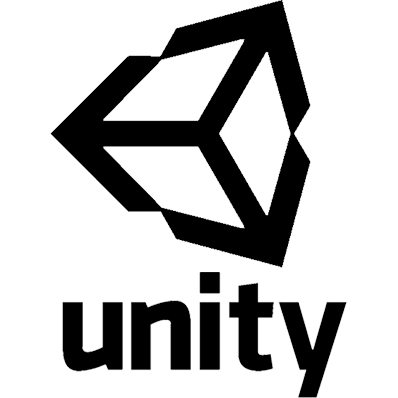
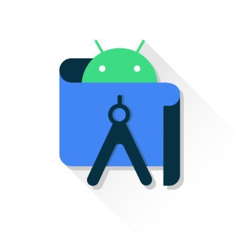

## Hi there 👋
 
🧭 ### I´m a developer, a standardized educational test designer, a teacher and an eternal student.

🛸 ### In a previous life, I used to be a philosopher and a logician.
🔥 ### Currently, I'm learning basically everything, but i´m focused in web and mobile apps and game development.
   ### email: megaskatos@gmail.com
 
## Languages and tools:

<!--
**ManuelAmado/ManuelAmado** is a ✨ _special_ ✨ repository because its `README.md` (this file) appears on your GitHub profile.

Here are some ideas to get you started:

- 🔭 I’m currently working on ...
- 🌱 I’m currently learning ...
- 👯 I’m looking to collaborate on ...
- 🤔 I’m looking for help with ...
- 💬 Ask me about ...
- 📫 How to reach me: ...
- 😄 Pronouns: ...
- ⚡ Fun fact: ...
-->
